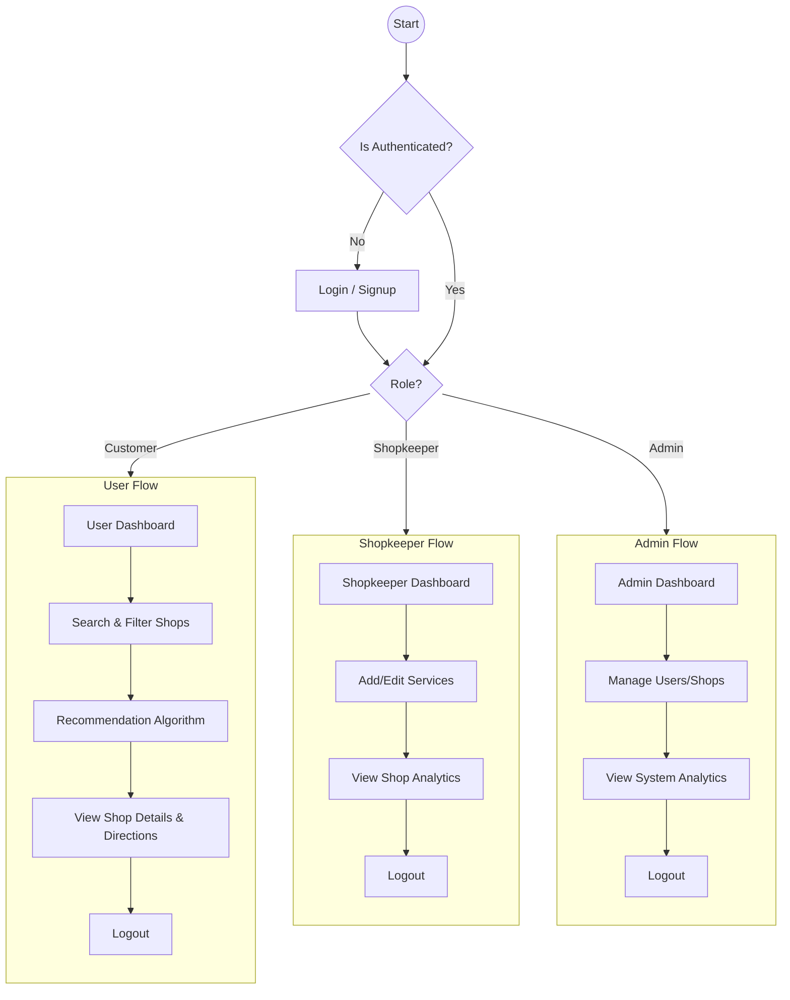
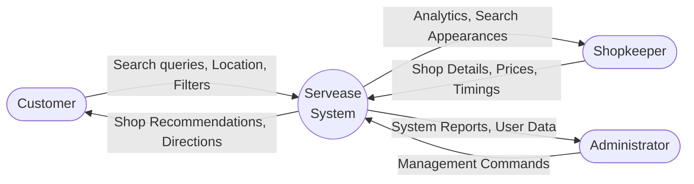
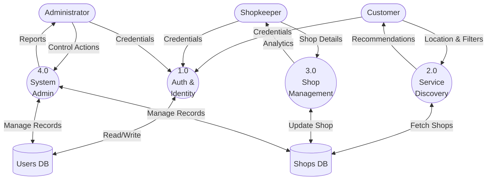

# Servease Flow Diagrams

## 1. Context Flow Diagram (CFD)

```mermaid
flowchart TD
    Start((Start)) --> Auth{Is Authenticated?}
    Auth -->|No| LoginSignup[Login / Signup]
    LoginSignup --> RoleCheck
    Auth -->|Yes| RoleCheck{Role?}
    
    RoleCheck -->|Customer| UserFlow
    RoleCheck -->|Shopkeeper| ShopFlow
    RoleCheck -->|Admin| AdminFlow

    %% User Flow
    subgraph UserFlow [User Flow]
        direction TB
        UDashboard[User Dashboard] --> Search[Search & Filter Shops]
        Search --> Algo[Recommendation Algorithm]
        Algo --> ViewShop[View Shop Details & Directions]
        ViewShop --> LogoutU[Logout]
    end

    %% Shopkeeper Flow
    subgraph ShopFlow [Shopkeeper Flow]
        direction TB
        SDashboard[Shopkeeper Dashboard] --> Manage[Add/Edit Services]
        Manage --> Analytics[View Shop Analytics]
        Analytics --> LogoutS[Logout]
    end

    %% Admin Flow
    subgraph AdminFlow [Admin Flow]
        direction TB
        ADashboard[Admin Dashboard] --> ManageUsers[Manage Users/Shops]
        ManageUsers --> SystemHealth[View System Analytics]
        SystemHealth --> LogoutA[Logout]
    end
```

## 2. Data Flow Diagram (DFD) - Level 0

```mermaid
flowchart LR
    User([Customer])
    Shopkeeper([Shopkeeper])
    Admin([Administrator])
    
    System(("Servease\nSystem"))
    
    User -- "Search queries, Location, Filters" --> System
    System -- "Shop Recommendations, Directions" --> User
    
    Shopkeeper -- "Shop Details, Prices, Timings" --> System
    System -- "Analytics, Search Appearances" --> Shopkeeper
    
    Admin -- "Management Commands" --> System
    System -- "System Reports, User Data" --> Admin
```

## 3. Data Flow Diagram (DFD) - Level 1

```mermaid
flowchart TD
    User([Customer])
    Shopkeeper([Shopkeeper])
    Admin([Administrator])

    %% Data Stores
    DB_Users[(Users DB)]
    DB_Shops[(Shops DB)]

    %% Processes
    P1(("1.0\nAuth &\nIdentity"))
    P2(("2.0\nService\nDiscovery"))
    P3(("3.0\nShop\nManagement"))
    P4(("4.0\nSystem\nAdmin"))

    %% Auth Flow
    User & Shopkeeper & Admin -->|Credentials| P1
    P1 <-->|Read/Write| DB_Users

    %% Service Discovery
    User -->|Location & Filters| P2
    P2 <-->|Fetch Shops| DB_Shops
    P2 -->|Recommendations| User

    %% Shop Management
    Shopkeeper -->|Shop Details| P3
    P3 <-->|Update Shop| DB_Shops
    P3 -->|Analytics| Shopkeeper

    %% Admin
    Admin -->|Control Actions| P4
    P4 <-->|Manage Records| DB_Users
    P4 <-->|Manage Records| DB_Shops
    P4 -->|Reports| Admin
```

